# Luồng Mua Gói và Thanh Toán - SubMe App

## Sơ đồ luồng hoạt động

```mermaid
flowchart TD
    Start([Người dùng mở App]) --> Login{Đã đăng nhập?}
    Login -->|Chưa| AuthScreen[Màn hình đăng nhập/đăng ký]
    AuthScreen --> Home
    Login -->|Rồi| Home[Màn hình Home]
    
    Home --> Explore[Tab Explore - Xem danh sách gói]
    Explore --> Browse[Duyệt các gói dịch vụ theo category]
    Browse --> SelectPackage[Click vào gói để xem chi tiết]
    
    SelectPackage --> PackageDetail[Màn hình Package Detail<br/>package/id.tsx]
    PackageDetail --> ViewInfo[Xem thông tin gói:<br/>- Tên, giá, mô tả<br/>- Vendor info<br/>- Đánh giá & reviews<br/>- Số người đăng ký]
    
    ViewInfo --> ClickSubscribe{User click<br/>'Đăng ký'}
    
    ClickSubscribe --> CheckAuth{Kiểm tra<br/>đăng nhập}
    CheckAuth -->|Chưa đăng nhập| AuthScreen
    CheckAuth -->|Đã đăng nhập| Checkout[Màn hình Checkout<br/>checkout.tsx]
    
    Checkout --> ReviewOrder[Xem lại đơn hàng:<br/>- Thông tin gói<br/>- Giá tiền<br/>- Thời hạn]
    ReviewOrder --> SelectPayment[Chọn phương thức thanh toán]
    
    SelectPayment --> PaymentMethod{Phương thức?}
    
    PaymentMethod -->|VNPay| VNPay[VNPay Payment Gateway]
    PaymentMethod -->|Stripe| StripeCheckout[Stripe Checkout<br/>stripe-checkout.tsx]
    PaymentMethod -->|MoMo| MoMo[MoMo Payment]
    PaymentMethod -->|ZaloPay| ZaloPay[ZaloPay Payment]
    
    VNPay --> ProcessPayment[Xử lý thanh toán]
    StripeCheckout --> ProcessPayment
    MoMo --> ProcessPayment
    ZaloPay --> ProcessPayment
    
    ProcessPayment --> PaymentAPI[API: POST /payments/create<br/>Body: subscription_id, method, amount]
    
    PaymentAPI --> PaymentGateway[Payment Gateway xử lý]
    PaymentGateway --> PaymentResult{Kết quả<br/>thanh toán}
    
    PaymentResult -->|Thành công| CreateSubscription[API: POST /subscriptions/create<br/>Tạo subscription mới<br/>Status: active]
    PaymentResult -->|Thất bại| PaymentFailed[Thông báo lỗi]
    
    PaymentFailed --> RetryPayment{User muốn<br/>thử lại?}
    RetryPayment -->|Có| SelectPayment
    RetryPayment -->|Không| End1([Kết thúc])
    
    CreateSubscription --> SavePayment[Lưu thông tin payment<br/>vào database]
    SavePayment --> UpdatePlan[Cập nhật subscriber_count<br/>của gói dịch vụ]
    
    UpdatePlan --> Callback[Callback từ Payment Gateway<br/>API: POST /payments/vnpay/callback]
    Callback --> VerifyPayment[Xác thực chữ ký<br/>và kết quả thanh toán]
    
    VerifyPayment --> PaymentSuccess[Màn hình Payment Success<br/>payment-success.tsx]
    
    PaymentSuccess --> ShowSuccess[Hiển thị:<br/>✅ Thanh toán thành công<br/>📦 Thông tin gói đã mua<br/>📅 Ngày bắt đầu/kết thúc<br/>💰 Số tiền đã thanh toán]
    
    ShowSuccess --> Actions{User chọn}
    
    Actions -->|Xem Subscriptions| SubscriptionsTab[Tab Subscriptions<br/>subscriptions.tsx]
    Actions -->|Tiếp tục khám phá| Explore
    Actions -->|Về trang chủ| Home
    
    SubscriptionsTab --> ViewSubs[Xem danh sách subscriptions:<br/>- Active subscriptions<br/>- Expired subscriptions<br/>- Cancelled subscriptions]
    
    ViewSubs --> SubDetail[Click để xem chi tiết<br/>subscription/id.tsx]
    
    SubDetail --> SubActions[Các hành động:<br/>- Xem lịch giao hàng<br/>- Đánh giá gói<br/>- Gia hạn<br/>- Hủy subscription<br/>- Bật/tắt auto-renew]
    
    SubActions --> End2([Kết thúc])

    style Start fill:#e1f5e1
    style End1 fill:#ffe1e1
    style End2 fill:#e1f5e1
    style PaymentSuccess fill:#90EE90
    style PaymentFailed fill:#FFB6C1
    style CreateSubscription fill:#87CEEB
    style ProcessPayment fill:#FFE4B5
```



## Chi tiết các bước

### 1. Khám phá và chọn gói (Explore → Package Detail)
- **Màn hình**: `app/(tabs)/explore.tsx`
- **API**: `GET /packages` - Lấy danh sách gói dịch vụ
- **Chức năng**: 
  - Tìm kiếm gói theo tên
  - Lọc theo category
  - Xem gói featured
  - Click vào gói để xem chi tiết

### 2. Xem chi tiết gói (Package Detail)
- **Màn hình**: `app/package/[id].tsx`
- **API**: `GET /packages/:id` - Lấy thông tin chi tiết gói
- **Thông tin hiển thị**:
  - Tên gói, giá, thời hạn
  - Mô tả chi tiết, features
  - Thông tin vendor
  - Đánh giá (rating & reviews)
  - Số người đã đăng ký
  - Button "Đăng ký ngay"

### 3. Xác nhận đơn hàng (Checkout)
- **Màn hình**: `app/checkout.tsx`
- **API**: 
  - `GET /packages/:id` - Lấy thông tin gói để review
  - `POST /subscriptions/create` - Tạo subscription mới (pending)
- **Thông tin**:
  - Thông tin gói đã chọn
  - Giá tiền cần thanh toán
  - Thời hạn subscription
  - Chọn phương thức thanh toán

### 4. Thanh toán (Payment Processing)
- **Màn hình**: `app/stripe-checkout.tsx` (cho Stripe)
- **API**: 
  - `POST /payments/create` - Tạo payment record
  - `POST /payments/vnpay/create` - Tạo VNPay payment URL (cho VNPay)
- **Phương thức hỗ trợ**:
  - ✅ VNPay (Vietnam)
  - ✅ Stripe (International)
  - ✅ MoMo (Vietnam)
  - ✅ ZaloPay (Vietnam)

### 5. Xử lý callback từ Payment Gateway
- **API**: 
  - `POST /payments/vnpay/callback` - Nhận callback từ VNPay
  - `POST /payments/stripe/webhook` - Nhận webhook từ Stripe
- **Xử lý**:
  - Xác thực chữ ký (signature verification)
  - Cập nhật trạng thái payment
  - Cập nhật trạng thái subscription (pending → active)
  - Tăng subscriber_count của gói

### 6. Hiển thị kết quả (Payment Success)
- **Màn hình**: `app/payment-success.tsx`
- **API**: `GET /subscriptions/:id` - Lấy thông tin subscription vừa tạo
- **Hiển thị**:
  - Thông báo thành công
  - Thông tin gói đã mua
  - Ngày bắt đầu và kết thúc
  - Số tiền đã thanh toán
  - Phương thức thanh toán
  - Buttons: "Xem subscriptions", "Tiếp tục mua sắm"

### 7. Quản lý Subscriptions
- **Màn hình**: `app/(tabs)/subscriptions.tsx`
- **API**: `GET /subscriptions/my-subscriptions` - Lấy danh sách subscriptions
- **Chức năng**:
  - Xem tất cả subscriptions (active, expired, cancelled)
  - Click để xem chi tiết subscription
  - Lọc theo trạng thái

### 8. Chi tiết Subscription
- **Màn hình**: `app/subscription/[id].tsx`
- **API**: 
  - `GET /subscriptions/:id` - Chi tiết subscription
  - `GET /delivery/:subscriptionId` - Lịch giao hàng
  - `POST /reviews` - Đánh giá gói
- **Hành động**:
  - Xem lịch giao hàng (delivery schedule)
  - Đánh giá và review gói dịch vụ
  - Gia hạn subscription
  - Hủy subscription
  - Bật/tắt auto-renew
  - Xem lịch sử thanh toán

## Các API liên quan

### Package APIs
```
GET    /packages                    - Lấy danh sách gói
GET    /packages/:id                - Lấy chi tiết gói
GET    /packages/category/:id       - Lấy gói theo category
GET    /packages/featured           - Lấy gói featured
```

### Subscription APIs
```
POST   /subscriptions/create        - Tạo subscription mới
GET    /subscriptions/my-subscriptions - Lấy subscriptions của user
GET    /subscriptions/:id           - Chi tiết subscription
PATCH  /subscriptions/:id/cancel    - Hủy subscription
POST   /subscriptions/:id/renew     - Gia hạn subscription
PATCH  /subscriptions/:id           - Cập nhật subscription (auto-renew)
```

### Payment APIs
```
POST   /payments/create             - Tạo payment record
POST   /payments/vnpay/create       - Tạo VNPay payment URL
POST   /payments/vnpay/callback     - Callback từ VNPay
POST   /payments/stripe/webhook     - Webhook từ Stripe
GET    /payments/subscription/:id   - Lịch sử payment của subscription
```

### Review APIs
```
POST   /reviews                     - Tạo review mới
GET    /reviews/plan/:planId        - Lấy reviews của gói
```

### Delivery APIs
```
GET    /delivery/:subscriptionId    - Lấy lịch giao hàng
PATCH  /delivery/:id/status         - Cập nhật trạng thái giao hàng
```

## Trạng thái Subscription

1. **pending_payment** - Đang chờ thanh toán
2. **active** - Đang hoạt động
3. **expired** - Đã hết hạn
4. **cancelled** - Đã bị hủy

## Trạng thái Payment

1. **pending** - Đang chờ xử lý
2. **success** - Thanh toán thành công
3. **failed** - Thanh toán thất bại

## Lưu ý quan trọng

- ✅ User phải đăng nhập trước khi mua gói
- ✅ Mỗi subscription có ngày bắt đầu và kết thúc
- ✅ Hỗ trợ auto-renew (tự động gia hạn)
- ✅ User có thể hủy subscription bất kỳ lúc nào
- ✅ Vendor nhận thông báo khi có đơn hàng mới
- ✅ User có thể đánh giá gói sau khi mua
- ✅ Hỗ trợ nhiều phương thức thanh toán
- ✅ Lưu lịch sử thanh toán đầy đủ
