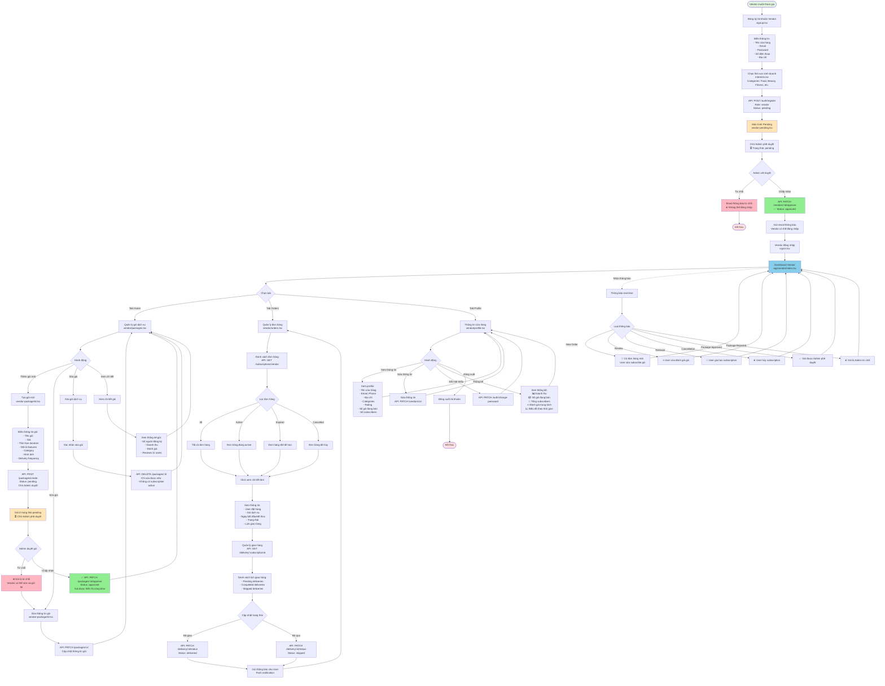

# Luồng Hoạt Động của Vendor - SubMe App

## Sơ đồ luồng hoạt động



## Chi tiết các bước

### 1. Đăng ký Vendor (Registration Flow)

#### Bước 1: Đăng ký tài khoản
- **Màn hình**: `app/(auth)/signup.tsx`
- **API**: `POST /auth/register`
- **Thông tin cần thiết**:
  ```json
  {
    "name": "Tên cửa hàng",
    "email": "vendor@example.com",
    "password": "********",
    "phone": "0123456789",
    "address": "Địa chỉ cửa hàng",
    "role": "vendor"
  }
  ```

#### Bước 2: Chọn lĩnh vực kinh doanh
- **Màn hình**: `app/(auth)/interests.tsx`
- **Categories**:
  - 🍔 Food & Beverage (Thực phẩm)
  - 💄 Beauty & Personal Care (Làm đẹp)
  - 💪 Health & Fitness (Sức khỏe)
  - 📚 Education (Giáo dục)
  - 🎮 Entertainment (Giải trí)
  - 🛍️ Shopping (Mua sắm)
  - 🏠 Home Services (Dịch vụ nhà)
  - 🚗 Transportation (Vận chuyển)

#### Bước 3: Chờ phê duyệt
- **Màn hình**: `app/(auth)/vendor-pending.tsx`
- **Trạng thái**: `pending`
- **Hiển thị**:
  - ⏳ Thông báo đang chờ Admin xét duyệt
  - 📧 Email xác nhận đã được gửi
  - ℹ️ Hướng dẫn tiếp theo

#### Bước 4: Admin phê duyệt
- **Admin Panel**: `app/(admin)/vendors.tsx` và `app/(admin)/vendor/[id].tsx`
- **API**: `PATCH /vendors/:id/approve` hoặc `PATCH /vendors/:id/reject`
- **Kết quả**:
  - ✅ **Approved**: Vendor có thể đăng nhập, status = `approved`
  - ❌ **Rejected**: Vendor bị từ chối, status = `rejected`

### 2. Quản lý gói dịch vụ (Package Management)

#### Tạo gói mới
- **Màn hình**: `app/(vendor)/packages.tsx` → Create new
- **API**: `POST /packages/create`
- **Thông tin gói**:
  ```json
  {
    "name": "Tên gói",
    "description": "Mô tả chi tiết",
    "price": 299000,
    "duration": 30,
    "category_id": 1,
    "features": ["Feature 1", "Feature 2"],
    "delivery_frequency": "weekly",
    "image_url": "https://...",
    "vendor_id": 123
  }
  ```
- **Trạng thái ban đầu**: `pending` (Chờ Admin duyệt)

#### Chỉnh sửa gói
- **Màn hình**: `app/vendor-package/[id].tsx`
- **API**: `PATCH /packages/:id`
- **Lưu ý**: 
  - Không thể sửa gói đang có subscription active
  - Sau khi sửa cần Admin duyệt lại

#### Xóa gói
- **API**: `DELETE /packages/:id`
- **Điều kiện**: 
  - Không có subscription active nào
  - Có modal xác nhận trước khi xóa

#### Thống kê gói
- **Thông tin hiển thị**:
  - 👥 Số subscribers hiện tại
  - 💰 Tổng doanh thu
  - ⭐ Rating trung bình
  - 💬 Số lượng reviews
  - 📊 Biểu đồ theo thời gian

### 3. Quản lý đơn hàng (Order Management)

#### Xem danh sách đơn hàng
- **Màn hình**: `app/(vendor)/orders.tsx`
- **API**: `GET /subscriptions/vendor`
- **Lọc theo trạng thái**:
  - **Active**: Đang hoạt động
  - **Expired**: Đã hết hạn
  - **Cancelled**: Đã bị hủy

#### Chi tiết đơn hàng
- **Thông tin**:
  - 👤 Thông tin khách hàng
  - 📦 Gói dịch vụ đã mua
  - 📅 Ngày bắt đầu / kết thúc
  - 💰 Giá trị đơn hàng
  - 📍 Trạng thái hiện tại

#### Quản lý giao hàng
- **API**: 
  - `GET /delivery/:subscriptionId` - Lấy lịch giao hàng
  - `PATCH /delivery/:id/status` - Cập nhật trạng thái
- **Trạng thái giao hàng**:
  - **Pending**: Chưa giao
  - **Delivered**: Đã giao
  - **Skipped**: Bỏ qua (user yêu cầu)
- **Thông báo**: Gửi push notification cho user khi giao hàng

### 4. Quản lý Profile

#### Thông tin cửa hàng
- **Màn hình**: `app/(vendor)/profile.tsx`
- **API**: `GET /vendors/:id`
- **Hiển thị**:
  - 🏪 Tên cửa hàng
  - 📧 Email, ☎️ Phone
  - 📍 Địa chỉ
  - 🏷️ Categories kinh doanh
  - ⭐ Rating (0-5 sao)
  - 📦 Số gói đang bán
  - 👥 Tổng số subscribers

#### Sửa thông tin
- **API**: `PATCH /vendors/:id`
- **Có thể sửa**:
  - Tên cửa hàng
  - Số điện thoại
  - Địa chỉ
  - Ảnh đại diện
  - Mô tả cửa hàng

#### Đổi mật khẩu
- **API**: `PATCH /auth/change-password`
- **Yêu cầu**: 
  - Mật khẩu cũ
  - Mật khẩu mới
  - Xác nhận mật khẩu mới

#### Thống kê tổng quan
- **Dashboard metrics**:
  - 💰 Tổng doanh thu
  - 📈 Doanh thu tháng này
  - 👥 Tổng subscribers
  - 📦 Số gói đang active
  - ⭐ Rating trung bình
  - 📊 Biểu đồ tăng trưởng

### 5. Thông báo (Notifications)

#### Loại thông báo vendor nhận được:

1. **🔔 Đơn hàng mới**
   - User vừa subscribe gói của vendor
   - Click để xem chi tiết đơn hàng

2. **⭐ Đánh giá mới**
   - User vừa rating/review gói
   - Hiển thị số sao và nội dung review

3. **🔄 Gia hạn subscription**
   - User gia hạn gói đã hết hạn
   - Tăng doanh thu

4. **❌ Hủy subscription**
   - User hủy subscription
   - Ghi nhận và cải thiện dịch vụ

5. **✅ Gói được phê duyệt**
   - Admin chấp nhận gói mới
   - Gói được hiển thị công khai

6. **❌ Gói bị từ chối**
   - Admin từ chối gói
   - Có lý do từ chối
   - Vendor có thể sửa và gửi lại

## Các API của Vendor

### Authentication APIs
```
POST   /auth/register              - Đăng ký vendor mới
POST   /auth/login                 - Đăng nhập
POST   /auth/logout                - Đăng xuất
PATCH  /auth/change-password       - Đổi mật khẩu
```

### Vendor Profile APIs
```
GET    /vendors/:id                - Lấy thông tin vendor
PATCH  /vendors/:id                - Cập nhật thông tin
GET    /vendors/me                 - Lấy thông tin vendor hiện tại
GET    /vendors/:id/statistics     - Thống kê vendor
```

### Package Management APIs
```
POST   /packages/create            - Tạo gói mới (status: pending)
GET    /packages/vendor            - Lấy danh sách gói của vendor
GET    /packages/:id               - Chi tiết gói
PATCH  /packages/:id               - Cập nhật gói
DELETE /packages/:id               - Xóa gói
GET    /packages/:id/statistics    - Thống kê gói
```

### Order Management APIs
```
GET    /subscriptions/vendor       - Lấy đơn hàng của vendor
GET    /subscriptions/:id          - Chi tiết đơn hàng
```

### Delivery Management APIs
```
GET    /delivery/:subscriptionId   - Lấy lịch giao hàng
PATCH  /delivery/:id/status        - Cập nhật trạng thái giao hàng
POST   /delivery/:id/note          - Thêm ghi chú giao hàng
```

### Review APIs
```
GET    /reviews/plan/:planId       - Lấy reviews của gói
GET    /reviews/vendor/:vendorId   - Lấy tất cả reviews của vendor
```

### Notification APIs
```
GET    /notifications              - Lấy danh sách thông báo
PATCH  /notifications/:id/read     - Đánh dấu đã đọc
DELETE /notifications/:id          - Xóa thông báo
```

## Quy trình phê duyệt

### Phê duyệt Vendor
1. Vendor đăng ký → Status: `pending`
2. Admin xem danh sách vendor pending
3. Admin xem chi tiết vendor (thông tin, categories)
4. Admin quyết định:
   - **Approve**: Status → `approved`, gửi email thông báo
   - **Reject**: Status → `rejected`, vendor không thể đăng nhập

### Phê duyệt Package
1. Vendor tạo gói → Status: `pending`
2. Admin xem danh sách gói pending
3. Admin xem chi tiết gói (tên, giá, mô tả, features)
4. Admin quyết định:
   - **Approve**: Status → `approved`, gói hiển thị công khai
   - **Reject**: Status → `rejected`, vendor có thể sửa và gửi lại

## Trạng thái Vendor

1. **pending** - Chờ Admin phê duyệt (mới đăng ký)
2. **approved** - Đã được duyệt, có thể đăng nhập
3. **rejected** - Bị từ chối
4. **suspended** - Bị tạm ngưng hoạt động

## Trạng thái Package

1. **pending** - Chờ Admin phê duyệt
2. **approved** - Đã được duyệt, hiển thị công khai
3. **rejected** - Bị từ chối
4. **inactive** - Không hoạt động (vendor tự tắt)

## Lưu ý quan trọng

- ✅ Vendor phải được Admin phê duyệt trước khi đăng nhập
- ✅ Gói mới phải được Admin duyệt trước khi hiển thị
- ✅ Không thể xóa gói đang có subscription active
- ✅ Vendor nhận thông báo real-time khi có đơn hàng mới
- ✅ Vendor quản lý lịch giao hàng và cập nhật trạng thái
- ✅ Vendor có thể xem thống kê doanh thu và subscribers
- ✅ User có thể rating/review gói của vendor
- ✅ Vendor có thể tạm dừng hoạt động gói (inactive)
- ✅ Admin có quyền suspend vendor nếu vi phạm
